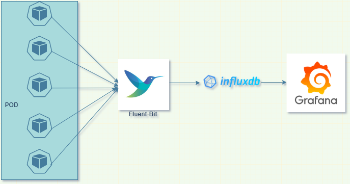

# 
 FIG stack

A minimal logging architecture in Kubernetes
 
<strong>FluentBit + InfluxDB + Grafana ⎈ FIG</strong>

##COMMANDS:
1. kubectl create ns monitoring
2. git clone https://github.com/iqrabismi/FIG.git
3. helm upgrade --install influxdb influxdb -n monitoring (Install Fluent Bit)
4. helm upgrade --install fluent-bit fluent-bit -n monitoring (Install Influx DB)
5. helm upgrade --install grafana grafana -n monitoring (Install Grafana)

** Try to use latest verison of Fluent Bit. Here it is used as  version: 1.8

How to exclude any path's  log (pod) not to send to influx DB. Example: Any pod in the namespace of kube-system & monitoring.
Specify in Values.yaml:

path: /var/log/containers/*.log
excludepath: /var/log/containers/*_monitoring_*.log, /var/log/containers/*_kube-system_*.log
NOTE: Make sure K8S-Logging.Exclude is On, else exclude path will not work.

How to specify any Influx DB host details which is not running inside cluster.
Specify in Values.yaml:

type: influx
  influx:
    host: <Host IP Address or DNS>
    port: 8086
    bucket: <Influx DB Name>
    org: <Influx DB Organization Name>
    user: fluentuser
    token: <Your Influx DB Token>
    sequence_tag: _seq
  
 AND in configMap.yaml:
  fluent-bit-input.conf: |
    [INPUT]
        Name             tail
        Path             {{ .Values.input.tail.path }}
        Exclude_Path     {{ .Values.input.tail.excludepath }}
        Parser           {{ .Values.input.tail.parser }}
        Tag              {{ .Values.filter.kubeTag }}
        Refresh_Interval 5
        Mem_Buf_Limit    {{ .Values.input.tail.memBufLimit }}
        Skip_Long_Lines  On
  
  NOTE: Make sure that, in Values.Yaml file, under filter section, kubeTag should contain the part of the text of those POD's name, whoes log fluent-bit will collect.

## Prerequisites
* [kubectl](https://kubernetes.io/docs/tasks/tools/install-kubectl/)
* [Helm 3](https://helm.sh/docs/intro/install/)

## Why FIG?
For a small Kubernetes cluster, I needed a minimal dashboard where logs from all the running applications in the Kubernetes environment can be viewed or `grep`ed from one place.
I thought about ELK (Elastic + Logstash + Kibana) first, but then I realized my small cluster has a config of only 2 nodes with a total 2 vCPU and 4GB RAM, which wouldn’t be a wise option for Elastic to run since it requires more resources to run smoothly. I wanted to use as few resources as possible to have the logging architecture setup.

_Credit: [Fig icon](https://www.iconfinder.com/icons/4619630/fig_fruit_food_fruit_fruits_icon) by [sbts2018](https://www.iconfinder.com/sbts2018)_
